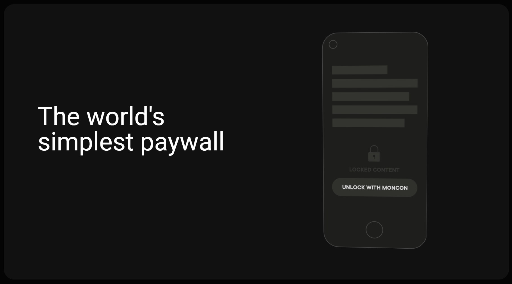

<!--
*** Thanks for checking out the Best-README-Template. If you have a suggestion
*** that would make this better, please fork the repo and create a pull request
*** or simply open an issue with the tag "enhancement".
*** Thanks again! Now go create something AMAZING! :D
-->


<!-- PROJECT SHIELDS -->
<!--
*** I'm using markdown "reference style" links for readability.
*** Reference links are enclosed in brackets [ ] instead of parentheses ( ).
*** See the bottom of this document for the declaration of the reference variables
*** for contributors-url, forks-url, etc. This is an optional, concise syntax you may use.
*** https://www.markdownguide.org/basic-syntax/#reference-style-links
-->

[](https://github.com/LedgerProject/moncon)
[](https://github.com/LedgerProject/moncon/network/members)
[](https://www.linkedin.com/company/moncon)
[](https://www.twitter.com/moncon_co)
[](https://moncon.co/)


<!-- PROJECT LOGO -->
<br />
<table align="center"><tr><td align="center" width="9999">
  <a href="https://gitlab.com/infinite-labs/moncon-framework">
    
  </a>

  <h1 align="center">The world's simplest paywall</h1>

  <p align="center">
    Welcome to our project
    <br />
    <strong>Want to know more? Explore our documents »</strong>
    <br />
    </td></tr></table>
<ol>
<li><a href="https://box.pdata.org/cloud/index.php/s/4D3HEH4wRCn6CEZ">moncon presentation</a></li>
<li><a href="https://app.dashboard.moncon.co">View Dashboard</a></li>
<li><a href="https://app.wallet.moncon.co">View Mobile PWA</a></li>
<li><a href="https://demo.moncon.co">Demo Web Content</a></li>
<li><a href="https://gitlab.com/infinite-labs/moncon-framework/issues">Report Bug</a></li>
<li><a href="https://gitlab.com/infinite-labs/moncon-framework/issues">Request Feature</a></li>
</ol>    
    
  </p>


<!-- TABLE OF CONTENTS -->
<details open="open">
  <summary>
  Table of Contents
  </summary>
  <ol>
    <li>
      <a href="#about-the-project">About The Project</a>
      <ul>
        <li><a href="#built-with">Built With</a></li>
      </ul>
    </li>
    <li>
    <a href="#projects">Projects</a>
    <ul>
    <li><a href="#dashboard">Dashboard</a></li>
    <li><a href="#api">API</a></li>
    <li><a href="#publisherjs">Publisher JS</a></li>
    <li><a href="#progressive-web-app">Progressive web app</a></li>
    </ul>
    </li>
    <li>
      <a href="#getting-started">Getting Started</a>
      <ul>
        <li><a href="#prerequisites">Prerequisites</a></li>
        <li><a href="#setup">Setup</a></li>
      </ul>
    </li>
    <li><a href="#roadmap">Roadmap</a></li>
    <li><a href="#contributing">Contributing</a></li>
    <li><a href="#terms-and-license">Terms and License</a></li>
    <li><a href="#about-us">About Us</a></li>
    <li><a href="#contact">Contact</a></li>
    <li><a href="#acknowledgements">Acknowledgements</a></li>
  </ol>
</details>


<!-- ABOUT THE PROJECT -->

## About The Project
<div align="center" width="9999">
  <a href="https://moncon.co">
    
  </a>

</div>

### What is the content creators problem?

Since the Internet was born, media, newspapers and other content creators haven't transformed their business model from off to on-line. They just change the physical paper to the digital. Newspapers were selling their pages to print advertising on them. 
Today they are still doing the same thing but in another format, counting pageviews. Their goal is to increase that number day by day. No other thing matters. The result is poor content, no matter quality, just “clics” to get more pageviews. In addition, the metric for measuring benefits of it is the CPM (cost per 1000 pageviews). At the beginning of the internet it was a good CPM, but today, with tons of tons of content increasing and the money invested increased but not at this rhythm , the CPM gets down and down. So then, the current business model is destined to die.

On the other side, users annoy ads. Actually, the human user eye is used to “see” ads but doesn’t remember them, users erase them when they are consuming content. 
And finally, in terms of business value, there is no reason that the media have this business model. It’s time to rethink and implement it.


### Built With

This section should list any major frameworks that you built your project using. Leave any add-ons/plugins for the acknowledgements section. Here are a the most importants.
* [NodeJS](https://nodejs.org/en/)
* [React](https://reactjs.org/)
* [Zenroom](https://zenroom.org/)
* [Cordova](https://cordova.apache.org/)
* [MongoDB](https://www.mongodb.com/)
* [Material UI](https://material-ui.com/)

<!-- PROJECTS -->
## Projects

### Dashboard

moncon Dashboard is encoded in React is designed to provide a content log to block and monetize, as well as metrics for your blocked content.

[See more...](./packages/dashboard)

### Progressive web app

monco Wallet is a Progressive Web App fully encoded in React. monco Wallet is designed to provide credential registration and QR code scanner and more.

[See more...](./packages/smartwallet-pwa)

### API

moncon API is encoded in NodeJS and is designed to run microservices required by the Dashboard and the progressive web app.

[See more...](./packages/api)

### Publisher JS

Publisher JS is encoded in JavaScript and is designed to execute the framework of the QR code to be able to block the content to be monetized.

[See more...](./packages/publisherjs)


<!-- GETTING STARTED -->
## Getting Started

### Prerequisites

- [git](https://git-scm.com/) v2.13 or greater
- [NodeJS](https://nodejs.org/en/) `12 || 14 || 15 || 16`
- [npm](https://www.npmjs.com/) v6 or greater

All of these must be available in your `PATH`. To verify things are set up
properly, you can run this:

```shell
git --version
node --version
npm --version
```

If you have trouble with any of these, learn more about the PATH environment
variable and how to fix it here for [windows](https://www.howtogeek.com/118594/how-to-edit-your-system-path-for-easy-command-line-access/) or [mac/linux](https://stackoverflow.com/questions/24306398/how-to-add-mongo-commands-to-path-on-mac-osx/24322978#24322978).

### Setup

> If you want to commit and push your work as you go, you'll want to
> [fork](https://docs.github.com/en/free-pro-team@latest/github/getting-started-with-github/fork-a-repo)
> first and then clone your fork rather than this repo directly.

After you've made sure to have the correct things (and versions) installed, you
should be able to just run a few commands to get set up:

```
git clone https://github.com/LedgerProject/moncon.git

```
If you want to run moncon, you should wake up the API, then run the Dashboard, install Publisher JS in the site you want to sell content and finally use the PWA to generate credentials and payments.

Consult the different project documentation to use:

- [Dashboard](./packages/dashboard/README.md)
- [Progressive web app](./packages/smartwallet-pwa/README.md)
- [API](./packages/api/README.md)
- [Publisher JS](./packages/publisherjs/README.md)


<!-- ROADMAP -->
## Roadmap

If you get any errors, please read through them and see if you can find out what
the problem is. If you can't work it out on your own then please [file an issue](https://github.com/LedgerProject/moncon/issues) and provide _all_ the output from the commands you ran (even if it's a lot).

<!-- CONTRIBUTING -->
## Contributing

**Working on your first Pull Request?** You can learn how from this _free_
guide [How to Contribute to an Open Source Project on GitHub](https://github.com/freeCodeCamp/how-to-contribute-to-open-source) 

If you have made a Pull Request, see our guide to [contributing](./CONTRIBUTING.md)

<!-- LICENSE -->
## Terms and License

- Released under the [MIT](./LICENSE).
- Copyright 2021 [Infinite Labs](https://infinitelabs.co/).
- Use it for personal and commercial projects, but please don’t republish, redistribute, or resell the application.

<!-- ABOUT US -->
## About Us

We focus on building a more secure, private and social internet using Open-Source and decentralized technologies.

As a team, we have developing digital products since 2012. In the last 5 years, we have focused on decentralized technologies. We aim to create products that can make a social impact. Because of that, we only use Open Source technologies, and create secure solutions taking good care of the user data and privacy.

<!-- CONTACT -->
## Contact

Infinite Labs - [@LabsInfinite](https://twitter.com/LabsInfinite) - hello@infinitelabs.co


<!-- ACKNOWLEDGEMENTS -->
## Acknowledgements
* [GitHub Emoji Cheat Sheet](https://www.webpagefx.com/tools/emoji-cheat-sheet)
* [Img Shields](https://shields.io)
* [Choose an Open Source License](https://choosealicense.com)
* [GitHub Pages](https://pages.github.com)
* [Animate.css](https://daneden.github.io/animate.css)
* [Loaders.css](https://connoratherton.com/loaders)
* [Slick Carousel](https://kenwheeler.github.io/slick)
* [Smooth Scroll](https://github.com/cferdinandi/smooth-scroll)
* [Sticky Kit](http://leafo.net/sticky-kit)
* [JVectorMap](http://jvectormap.com)
* [Font Awesome](https://fontawesome.com)
